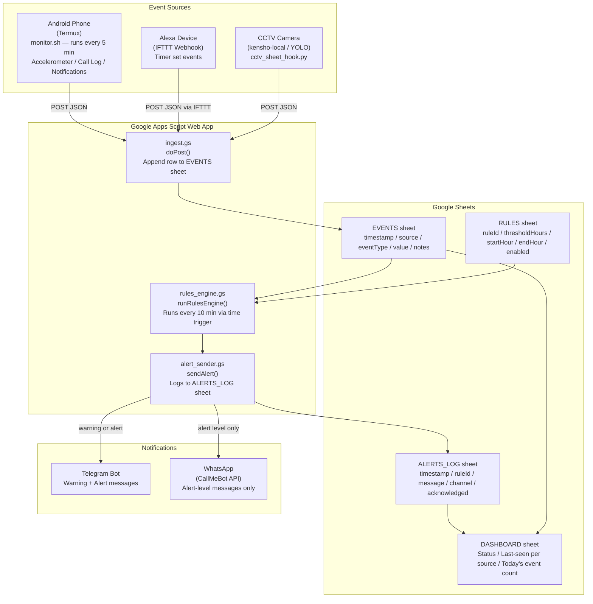

# TrackWise LDRC — Architecture

TrackWise LDRC is an elderly wellbeing monitoring system for the Learning & Development Resource Centre (LDRC) that aggregates activity signals from an Android phone, Alexa device, and a CCTV camera into a Google Sheets dashboard, then fires Telegram and WhatsApp alerts when configured silence thresholds are breached.

## Rules Engine

The rules engine (`rules_engine.gs`) polls every 10 minutes and evaluates four configurable rules against the EVENTS sheet:

| Rule ID | Trigger |
|---|---|
| `no_movement` | No phone accelerometer movement for N hours |
| `no_phone_usage` | No calls or notifications for N hours |
| `no_morning` | No activity from any source after 6 AM |
| `combined_silence` | No signal from phone, Alexa, or CCTV for N hours |

A 60-minute cooldown prevents duplicate alerts for the same rule. Warnings send to Telegram only; alerts send to both Telegram and WhatsApp via CallMeBot.
